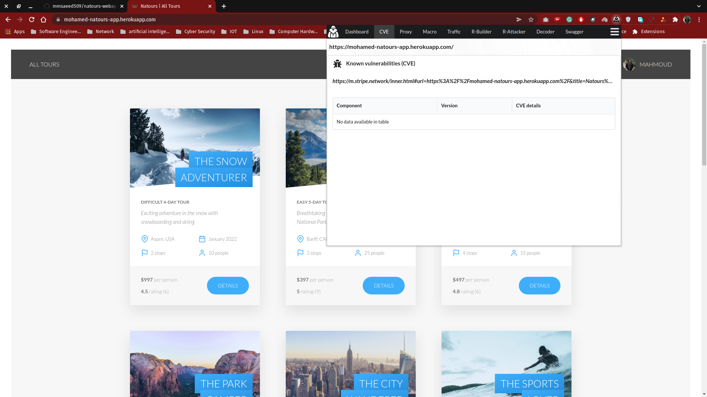

# natours-webapp--tour-Reservation

**Admin** and **lead guide** can create tour or edit it , and **normal user** cans book a ***tour*** and view all tours

and write reviews for any tour.

Our API uses stripe for payment process and mail trap for dev env and sendgrid for prod env for sending emails.
### You can read the API [documentation](https://documenter.getpostman.com/view/18927843/UVRGCihu) for all the endpoints.
### You can check the [web app](https://mohamed-natours-app.herokuapp.com/) that implements some of the API features  
### To run the app
- Install all the dependencies from [package.json](https://github.com/mohamed-mahmoud377/natours-webapp--tour-Reservation/blob/5dcaca0f248cc7159dd45708c14be0c22616360c/package.json) 
- Set all the environment variables in [config-example.env](https://github.com/mohamed-mahmoud377/natours-webapp--tour-Reservation/blob/db9137b2c394f237909203f294d12dec2f927d52/config-example.env) and then name it config.env 
- to run in development  `npm run dev`
- to run in production `npm run start:prod` 
## Very Secure!

